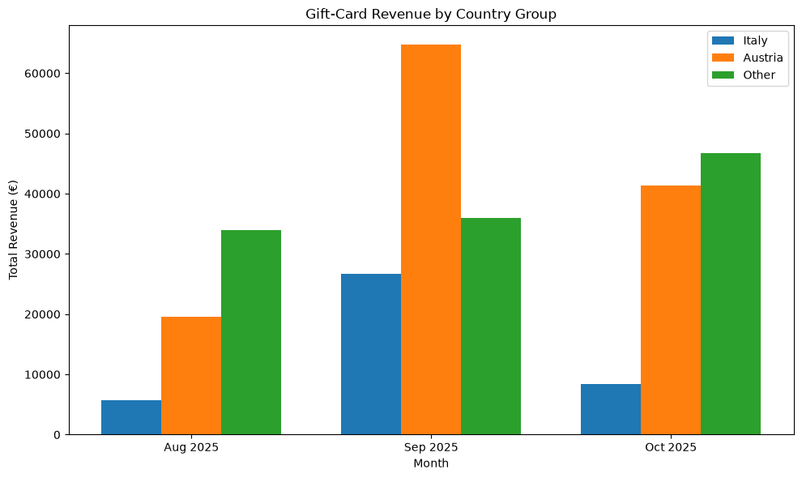
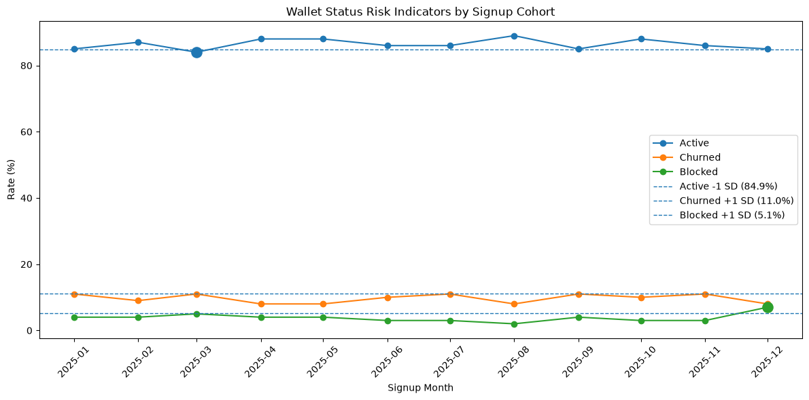

# Payments Analytics: September Investigation & Key Findings

## Executive Summary

The analysis focused on commercial performance, wallet onboarding, and potential indicators of risk around the September period. Two notable changes emerged: a significant increase in gift-card sales and a decline in 30-day wallet activation.

Neither finding alone provides sufficient evidence of a risk event. The September changes should therefore be treated as signals for monitoring and further investigation rather than confirmed anomalies. A further decline in wallet activation was observed in November; if this trend continues as the cohort matures, it would warrant additional investigation and potentially escalation to Risk.

## 1. Gift-Card Sales Increased Sharply in September

Gift-card revenue increased by approximately **120% MoM in September** (`MoM change = +1.20`), substantially exceeding the changes observed across the other segments.

The increase was disproportionately driven by **Italy** and **Austria**. In Italy, the gift-card sales were more than twice the level observed in the the previous month before returning toward baseline in October. The average transactions per wallet increased by over 1 transaction and the average purchase increased approximately 80 EUR. In Austria, the authorized transactions in EUR increased nearly 3 times, the number of unique wallets purchasing gift cards increased by almost double, and the transaction count more than doubled.



This appears to be a **commercial anomaly rather than an immediate risk signal**. I would not surface the increase to Risk without first understanding its underlying drivers.

Further investigation should decompose the increase into:

- Transaction volume 
- Merchant concentration
- Refunds and reversals
- Whether the increase was broad-based or driven by a small number of customers or merchants

Understanding these drivers would help distinguish a legitimate commercial event from behavior that may warrant additional Risk review.

## 2. September Wallet Activation Declined

The September signup cohort showed a decline in 30-day wallet activation MoM, accompanied by a lower current active rate for the cohort.

However, the decline in activation remained **within 1 standard deviation of the yearly average**. Blocked and churned rates were somewhat elevated but likewise remained **within +1 standard deviation** of their yearly averages.



Based on the available evidence, I would therefore treat September as a **signal worth monitoring rather than a confirmed risk anomaly**.

The latest signup cohort also has an incomplete 30-day observation window. Consequently, its activation rate should not be interpreted as a genuine deterioration until the full 30-day period has elapsed. However, as mentioned, there was a decrease in November in activation and if the trend continues, this would be worth bringing to Risk's attention.

## Recommendations & Next Steps

With additional time, I would build a **Risk monitoring dashboard** containing key indicators of wallet and transaction health, including:

- 30-day wallet activation rate and MoM change
- New wallet registrations
- Current active, blocked, and churned cohort rates
- Transaction and revenue trends
- Segment-level revenue and MoM changes
- Refund and reversal rates
- Geographic and merchant concentration
- Anomaly indicators against historical baselines

The dashboard should support both **monthly trend analysis and more frequent/daily monitoring** of selected operational metrics, allowing Risk to identify emerging changes quickly rather than relying on retrospective investigation.

I would also expose a broader **commercial performance view** covering:

- Monthly revenue
- New wallets
- Wallet activations
- Churn
- Segment performance
- Transaction volumes
- Average transaction value
- Geographic performance

This would provide a common view of business health while allowing Risk and commercial stakeholders to investigate unusual movements from their respective perspectives.

## Assumptions & Limitations

### Data Cleaning & Validation

- Categorical fields such as transaction status, merchant segment, and wallet status were standardized during staging by trimming whitespace and normalizing case.
- Transaction amounts were validated using a custom positive-value test. Given the available transaction data and business context, positive transaction amounts were treated as the expected condition.
- Unexpected onboarding values were flagged using a custom data-quality test rather than silently corrected.
- dbt `not_null` validations were applied to fields where completeness is expected based on the available year of historical data and their role in the analytical models.

### Analytical Assumptions

- A wallet is considered **activated** when it completes at least one authorized transaction within 30 days of signup.
- Month-over-month comparisons assume that the relevant monthly data is complete.
- The most recent signup cohort does not yet have a complete 30-day observation window and is therefore not directly comparable with mature cohorts.
- Standard-deviation thresholds are used as **screening indicators**, not as evidence of causality or confirmed risk.

### Data Quality & Limitations

- Wallet status reflects the **current status available in the source data**, not the historical status at a particular point in time. The dataset does not contain status-change timestamps, so historical churn or blocked events cannot be reliably reconstructed.
- **740 wallet IDs referenced by transactions are not present in the wallet source table**, indicating a data-quality issue that would require further investigation.
- Incremental models were considered based on transaction dates to determine whether new records could be appended to existing data. However, the presence of transaction records referencing wallet IDs that are missing from the wallet source means that backfilling may be necessary, and a different incremental strategy may be required in a production environment.

## How to Run

### dbt + DuckDB

The core analysis is implemented in **dbt using DuckDB**. The dbt project is the primary deliverable and can be run independently of the exploratory notebooks.

Create a Python virtual environment and install the project dependencies:

```bash
python -m venv .venv
.venv\Scripts\activate

pip install -r requirements.txt
```

The requirements include dbt Core and the DuckDB adapter required to run the project.

From the project root, run:

```bash
dbt debug
dbt run
dbt test
```

`dbt debug` verifies the local setup, `dbt run` builds the staging, intermediate, mart, and exploratory models, and `dbt test` runs the project's data-quality tests.

### Python Exploration & Visualizations

Python was also used separately for exploratory analysis and visualization. This work was not required for the dbt transformation layer; it was used to explore the data, investigate the September findings, and produce the charts included with the analysis.

The notebooks are:

- `01_eda.ipynb`: initial exploratory data analysis
- `02_duckdb.ipynb`: inspection of the DuckDB database and generated tables
- `03_investigation.ipynb`: investigation of the September findings and visualizations

The notebooks use the DuckDB database generated by dbt and require the additional Python packages included in `requirements.txt`.

After installing the requirements above, launch Jupyter with:

```bash
jupyter notebook
```

or examine the notebooks using VS Code.

The Python work is intentionally kept separate from the dbt transformation layer. dbt provides the reproducible analytical models, while Python was used for exploratory analysis and visualization.

# Project Structure

```text
payments/
├── images/
│   ├── giftcard_by_country.png
│   ├── mom_revenue_change.png
│   ├── risk_plot.png
│   └── wallet_activation.png 
├── models/
│   ├── staging/
│   │   ├── sources.yml
│   │   ├── stg_merchants.sql
│   │   ├── stg_transactions.sql
│   │   └── stg_wallets.sql
│   │
│   ├── intermediate/
│   │   ├── int_transaction_enriched.sql
│   │   └── int_wallet_activation.sql
│   │
│   ├── marts/
│   │   ├── fct_monthly_revenue.sql
│   │   └── fct_wallet_activation.sql
│   │
│   └── explore/
│       └── giftcard_sales.sql
│
├── notebooks/
│   ├── 01_eda.ipynb
│   ├── 02_duckdb.ipynb
│   └── 03_investigation.ipynb
│
├── tests/
│   ├── onboarding_values.sql
│   └── positive_numbers.sql
│
├── dbt_project.yml
├── packages.yml
├── requirements.txt
├── README.md
└── .gitignore
```

The project follows a layered dbt structure:

- **Staging**: cleans and standardizes the raw source data.
- **Intermediate**: contains reusable business logic and enriched datasets that
  can support multiple downstream analyses.
- **Marts**: contains the final analytical models intended to expose stable
  business metrics for reporting and stakeholder consumption.
- **Explore**: contains investigation-specific models used to drill into
  anomalies and answer ad-hoc business questions. These models are not intended
  to form part of the core reporting layer. I would probably do these queries
  in BigQuery as part of a deeper investigation before either surfacing
  a relevant mart or providing a report of my findings.
- **Notebooks**: contains exploratory data analysis, DuckDB inspection, and
  investigation visualizations.
- **Tests**: contains custom data-quality tests for business rules and data
  validity.